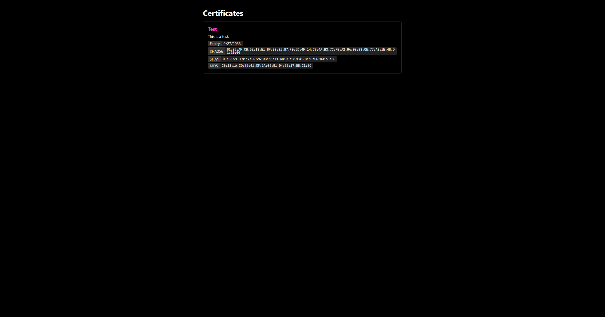

# CA-Cert List

> This application provides a simple list to download your own root CA certificates. Useful for people that self-sign their own certificates.



## Usage

Create your own Dockerfile which derives from `ghcr.io/thedevminertv/ca-cert-list:latest` and add your own certificates to `/certs`.
The application will bind to port 80.

The application expects the `/certs` folder to contain the following files:

- `<Certificate name>` [Folder]
  - `cert.crt` [File]: Your certificate
  - `description.txt`: A description of your certificate

Example Dockerfile:

```dockerfile
FROM ghcr.io/thedevminertv/ca-cert-list:latest

COPY ./certs /certs
```

Build and run the container:

```bash
docker build -t my-ca-cert-list .
docker run -d -p 80:80 my-ca-cert-list
```

## License

This project is licensed under the MIT License. See [LICENSE](./LICENSE) for more information.
