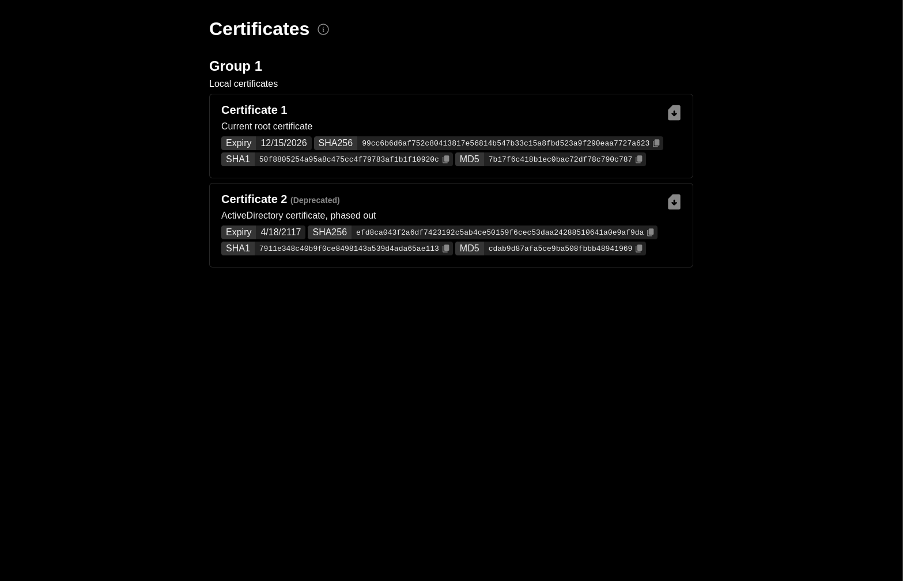

# CA-Cert List

> This application provides a simple list to download your own root CA certificates. Useful for people that self-sign their own certificates.



## Usage

Create your own Dockerfile which derives from `ghcr.io/thedevminertv/ca-cert-list:latest` and add your own certificates to `/certificates`.
The application expects a `config.yml` file in `/config.yml` of which the schema is this:

```yaml
---
groups:
  - name: Group 1
    description: Description of group 1 # This is optional
    deprecated: false # This is optional and defaults to `false`
    certificates:
      - name: Certificates 1
        path: /certificates/cert1.crt # Any PEM encoded public key is valid here
        description: Description of group 1 # This is optional
        deprecated: false # This is optional and defaults to `false`
```

List the certificates in the order they should be shown:

```dockerfile
FROM ghcr.io/thedevminertv/ca-cert-list:latest

COPY ./certificates /certificates
COPY ./config.yml /config.yml
```

Build and run the container (the web server will listen on port 80):

```bash
docker build -t my-ca-cert-list .
docker run -d -p 80:80 my-ca-cert-list
```

## License

This project is licensed under the MIT License. See [LICENSE](./LICENSE) for more information.
